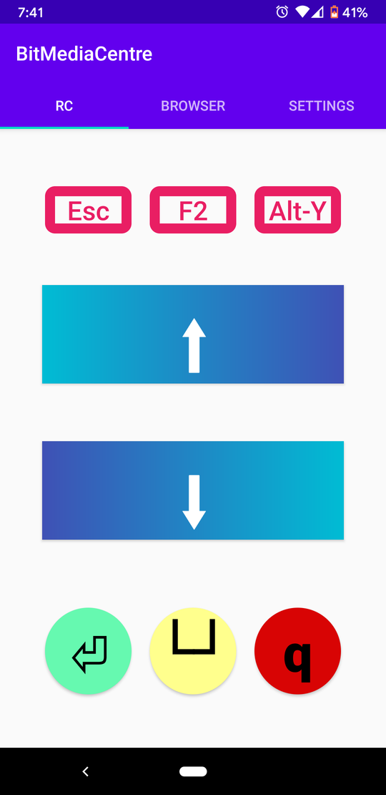
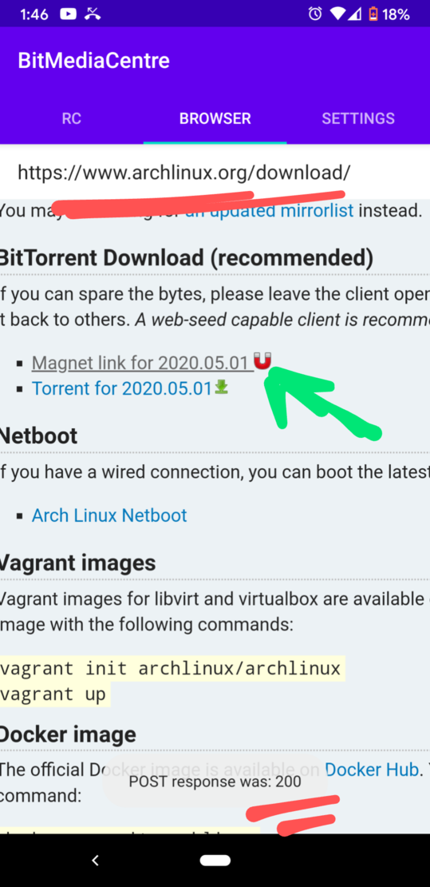

# BitMediaCentre
Simple Media Centre PC Build Using Fedora-IOT 

## Features:

  * Wayland-only system with Sway 1.x compositor

  * RPMFusion repository (for mpv, etc)

  * firewalld and SELinux not disabled ;)

  * no login screen, boots straight into a Simple "Commander"-style app, for managing media content:

 


  * Remote Control Android App:



  * Launch new downloads by clicking on any `magnet` link whilst using the browser included in the app!
    


*here, 200 OK response means that the pod was accepted for scheduling by the cloud service*


## Installation Steps:

1. Install grub to a USB stick
2. Copy the kickstart file, and the [Fedora-IOT](https://getfedora.org/en/iot/) iso (eg. Fedora-IoT-IoT-ostree-x86_64-33-20201102.0.iso) to the USB drive
3. Edit the kickstart:
  - wifi (search for "REDACTED")
  - verify hard drive selection
  - timezone
  - enable optional features
  - any other customisation (eg. kparam)
4. Edit the grub.cfg and add something like:
```
menuentry "[WARNING] NEW-KS.CFG" {
        set root='(hd0,msdos1)'
        set isofile='(hd0,msdos1)/Fedora-IoT-IoT-ostree-x86_64-33-20201102.0.iso'
        loopback loop $isofile
        linux (loop)/isolinux/vmlinuz inst.stage2=hd:LABEL=YourLabel:/Fedora-IoT-IoT-ostree-x86_64-33-20201102.0.iso nomodeset inst.ks=hd:LABEL=YourLabel:/NEW-KS.CFG
        initrd (loop)/isolinux/initrd.img
}
```
,where `YourLabel` is the Label of the USB stick. Note: dont change the name of the .iso file it will cause problem.

5. Boot the USB stick in the TARGET computer and choose the grub option from step #4 (CAUTION: Will wipe hard drive without prompting!!)


