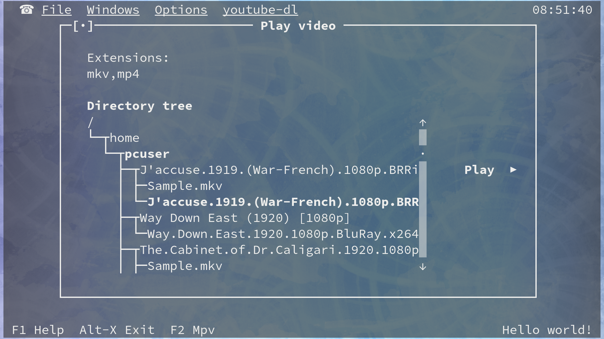
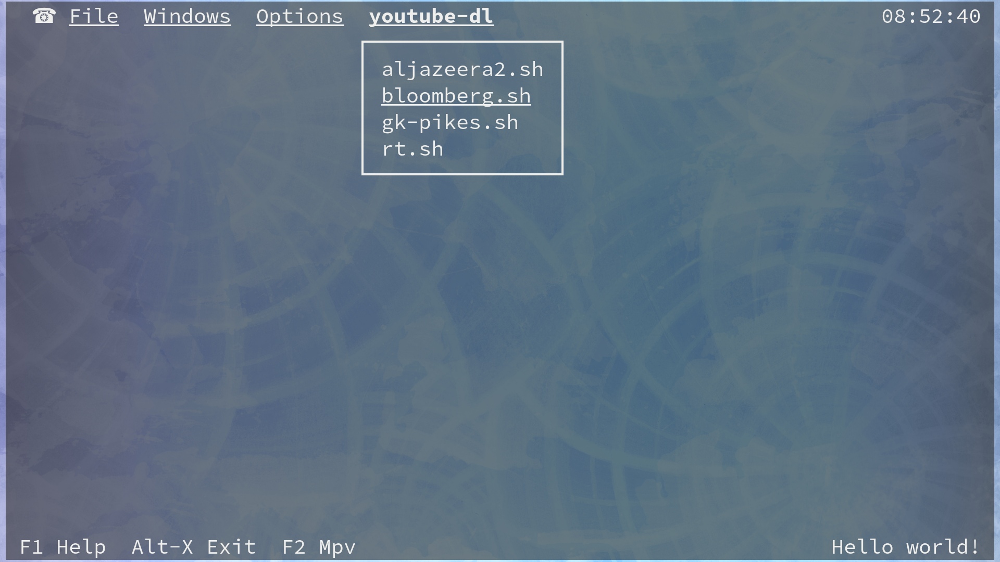

# BitMediaCentre
Simple Media Centre PC Build Using Fedora Kickstart


## Features:

  * Wayland-only system with Sway 1.x compositor

  * RPMFusion repository (for mpv, etc)

  * Simple "Commander"-style app for managing media content:

 




### Optional Features (These need to be enabled in the kickstart file):
  * Remote Control Android App:


  * Launch new downloads by clicking on any `magnet` or `.torrent` link whilst using the browser included in the app!
    


  * Droidmote Remote control app is also supported! (Unrelated to this project, it can be found at the Google play store)

## Installation Steps:

1. Install grub to a USB stick
2. Copy the kickstart file, and the `netinst` fedora iso (eg. Fedora-Server-netinst-bleh.iso) to the USB drive
3. Edit the kickstart:
  - wifi (search for "REDACTED")
  - verify hard drive selection
  - enable optional features
  - any other customisation
4. Edit the grub.cfg and add something like:
```
menuentry "bitmediacentre.ks" {
        set root='(hd0,msdos1)'
        set isofile='(hd0,msdos1)/Fedora-Server-netinst-x86_64-31-1.9.iso'
        loopback loop $isofile
        linux (loop)/isolinux/vmlinuz inst.stage2=hd:LABEL=YourLabel:/Fedora-Server-netinst-x86_64-31-1.9.iso nomodeset inst.ks=hd:LABEL=YourLabel:/bitmediacentre.ks
        initrd (loop)/isolinux/initrd.img
}
```
,where `YourLabel` is the Label of the USB stick

5. Boot the USB stick in the TARGET computer and choose the grub option from step #4 (CAUTION: Will wipe hard drive without prompting!!)


